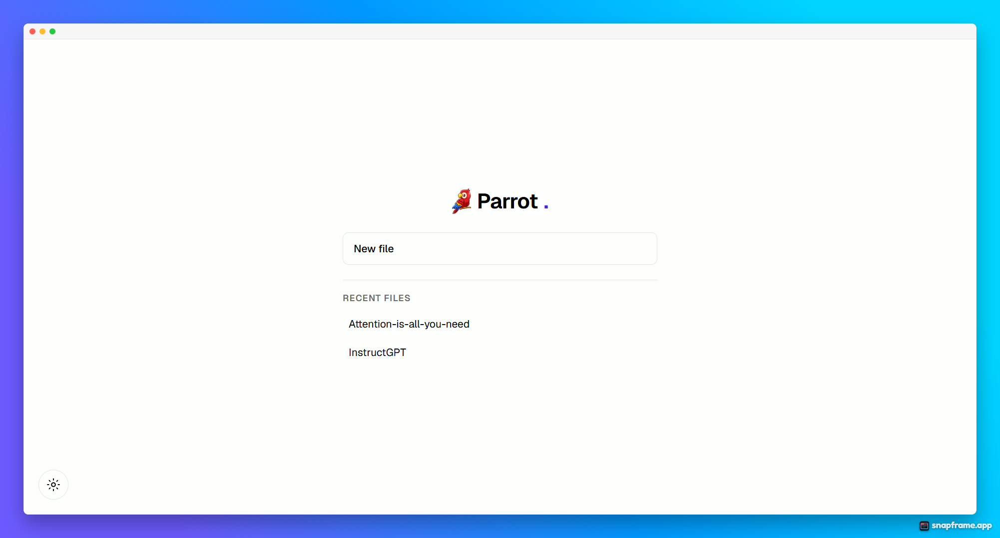

# Parrot



A local-first reader for research-paper PDFs. Open a paper, read it, highlight it, and ask
an AI about any figure, table, or passage. Everything runs on your own machine; fork it and go.

## Stack

- **Next.js** (App Router) + **React**, run with **Bun**
- **Base UI** headless components, styled with plain CSS Modules (no Tailwind)
- **better-sqlite3** for local metadata, highlights, and chats
- **react-pdf** (pdf.js) for rendering
- **Vercel AI SDK** harness — multi-provider (Claude, GPT, xAI, Groq, OpenRouter, Ollama,
  LM Studio, and any OpenAI-compatible endpoint)

## Getting started

```bash
bun install
bun run dev
```

Open [http://localhost:3000](http://localhost:3000).

## Where your data lives

Parrot keeps everything in an app-data folder in your home directory:

```
~/.parrot/
  parrot.db      SQLite: documents, highlights, chats, settings
  pdfs/          your uploaded PDFs, one file per document
```

To reset Parrot, delete `~/.parrot`.

## Features

- Home screen with a **New file** button and a **Recent files** list
- Continuous-scroll PDF reader with zoom
- Text selection menu: **Copy**, **Highlight**, and **Ask Parrot**
- Highlights persist and stay aligned at any zoom level
- **Ask Parrot**: chat about selected text; **Save** anchors the thread onto a highlight to
  reopen later
- **AI pen**: screenshot a figure, table, or chart and ask about it

## Configure an AI provider

API keys are read from the environment (and never written to `parrot.db`). Copy the example
file and fill in the provider(s) you use:

```bash
cp .env.example .env.local
```

Then open **Settings** (gear, bottom-left of the home screen) to pick the active provider and
model. Local runtimes (Ollama, LM Studio) need no key — just their base URL. Supported keys:

| Provider | Env var | Notes |
| --- | --- | --- |
| Claude | `ANTHROPIC_API_KEY` | |
| OpenAI | `OPENAI_API_KEY` | |
| xAI (Grok) | `XAI_API_KEY` | |
| Groq | `GROQ_API_KEY` | |
| OpenRouter | `OPENROUTER_API_KEY` | |
| Ollama | — | `OLLAMA_BASE_URL` (default `http://localhost:11434/v1`) |
| LM Studio | — | `LMSTUDIO_BASE_URL` (default `http://localhost:1234/v1`) |
| OpenAI-compatible | `OPENAI_COMPATIBLE_API_KEY` | set the base URL in Settings |

Ask Parrot sends the selected text (or the cropped region image) to your configured provider.
