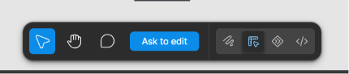

Name: Reading Screen 

Description:
This is the screen where the user will see the content of the pdf he is reading.

It will function as a normal pdf reader with highlight and zoom in/out.
This tools will be on a toolbar 
It will be at the bottom of the screen. It will have the zoom in and zoom out and the highlight pen ( where you can click to change the color of the highlight) and the AI pen. The AI pen allows you to select ( like how the screenshot tool works) a part of the document - graphs, tables, pictures etc. 

When the reader selects a content on the pdf, he sees the pop up menu.
He see copy , highlight and ask parrot. 

Ask parrot - this is the AI feature.  you get an input field right over the selected text or content and you type your message into it and send. The reponse is should as a pop over that floats around the content and the reader can continue the message. there should be a save button that allows the user to save the messages specifically for that content by highlighting it so that the reader can toggle and read another time. when you use the AI pen , you get the input field and you enter your prompt.
